<div align="center">



<h1>🔌&nbsp;MCP Switchboard</h1>

<p>
  <b>One connector. Every tool. Both Claude <i>and</i> ChatGPT</b> — driving the same apps through one governed control plane on your machine.<br/>
  Local-first · bring your own keys · run fully offline with a local LLM · <b>nothing leaves your machine</b>.
</p>

[](LICENSE)
[](https://modelcontextprotocol.io)
[](https://nodejs.org)
[](#everything-is-verified-by-a-deterministic-oracle)
[](#project-status)
[](#security)

<p>
  <a href="#quickstart"><b>Quickstart</b></a> ·
  <a href="#why-its-different">Why it's different</a> ·
  <a href="#the-big-idea">The big idea</a> ·
  <a href="#cli">CLI</a> ·
  <a href="#everything-is-verified-by-a-deterministic-oracle">Verified</a> ·
  <a href="#docs">Docs</a>
</p>

</div>

---

## The big idea

You have **two of the best agents in the world** — Claude and ChatGPT — and you'd like them to
actually *do things*: read your GitHub, triage your Gmail, update Notion, ping Slack, hit your
internal API. Today that means wiring every client to every app by hand (**N×M** pain), and the
"easy" hosted shortcut parks **your OAuth tokens on someone else's server**.

MCP Switchboard collapses **N×M into N×1**. You run **one** local process that re-exposes all your MCP
servers behind **one governed endpoint**. You add that endpoint **once** as a connector in Claude,
and **once** in ChatGPT — and now *both* assistants reach the same tools, through the **same
encrypted vault, the same on/off + read/write/full policy, the same approval gates, and the same
audit log**. One control plane. Your machine. No "us" in the middle.

Think of it as **your own private "Connectors" page** — the kind ChatGPT and Claude each ship as a
walled garden — except it lives on *your* box, mounts the *whole* MCP ecosystem instead of a curated
shortlist, and serves **every** assistant at once. Browse a catalog of thousands of toolkits in the
dashboard, flip one on, and `switchboard install claude-code` wires it into your client in a single
command. No tokens handed to a vendor, no per-call meter, no treadmill.

```
     Claude Desktop ─┐                            ┌─ Gmail        (read)
     Claude Code  ───┤       ┌────────────┐       ├─ GitHub       (write · delete blocked)
     claude.ai web ──┼─ MCP ▶│ SWITCHBOARD │▶──────┼─ Notion       (read)
     ChatGPT      ───┤       │ vault·policy│       ├─ Slack        (OFF)
     Cursor/agents ──┘       │ ·audit·gates│       ├─ your REST API (app2mcp)
                             └────────────┘       └─ a local LLM   (offline council)
```

### "So Claude and ChatGPT share my email?" — almost; here's the precise mental model

You're **right** that MCP Switchboard is the single connector both assistants point at to reach every
app. Two corrections worth making:

- **It's a shared *control plane*, not a shared *session*.** Claude and ChatGPT don't see each
  other's chats or share conversation state. What they share is the layer *underneath*: one set of
  BYO credentials, one policy, one audit trail. Both can act on your Gmail — each governed
  identically, every call logged in one place — but neither inherits the other's context.
- **Local clients connect directly; cloud clients need a door.** Anything running **on your machine**
  (Claude Desktop, Claude Code, Cursor, your own agents) reaches `127.0.0.1:8088` directly with an
  API key — zero setup. Anything running **in a vendor's cloud** — **claude.ai web** and **ChatGPT's
  custom connectors** (Developer Mode, on Pro/Team/Enterprise/Edu) — *cannot* reach your laptop's
  localhost. For those, run `switchboard expose` to get a public HTTPS URL and turn on the built-in
  **OAuth 2.1 + PKCE** server, then paste that URL as the connector and authorize once. Same governed
  endpoint, reachable from the cloud, still zero token custody. See
  **[Connecting cloud clients](#connecting-cloud-clients--claudeai-web--chatgpt-oauth-21--pkce-phase-5b)**.

### No cloud account? Run it fully offline.

Adoption shouldn't require an API bill. Point MCP Switchboard's **council** at a **local LLM** — Ollama,
LM Studio, llama.cpp, or vLLM — and you get a second-opinion / debate model with **zero cloud, zero
keys, zero data leaving the box**. You don't even have to find the URL: `switchboard local-llm`
**auto-detects** a running OpenAI-compatible server on the usual ports, and `switchboard local-llm wire`
writes the provider block for you. Download a model, run two commands, and the whole stack (vault,
policy, audit, council) runs on your hardware. See **[Run it fully offline with a local LLM](#run-it-fully-offline-with-a-local-llm-auto-detected)**.

## Why it's different

|  | MCP Switchboard | Hosted tool routers |
|---|---|---|
| **One connector, every assistant** | Add it once; **Claude *and* ChatGPT** share the same governed tools | Per-vendor, per-app setup |
| **Where your tokens live** | A local AES-256 vault on **your** machine | Their cloud |
| **Integrations** | **Mounts existing MCP servers** — no treadmill | Hand-built, must be maintained |
| **One-command setup** | `switchboard install claude-code` wires it into 5 clients | Copy-paste JSON per client |
| **Browse & connect** | A local catalog of thousands of toolkits (MCP Registry + APIs.guru) | A curated vendor shortlist |
| **Governance** | Per-tool `read/write/full` + approval gates + audit log | Usually all-or-nothing |
| **Profiles** | Named views — a locked-down "demo" vs a full "dev" surface, one switch | None |
| **Rate limits + spend budgets** | Per-minute/hour/day call **and cost** ceilings, fail-closed | Pay the overage |
| **Resilience** | Per-server **circuit breaker** trips a flapping upstream, fast-fails | Hangs propagate |
| **Works offline** | Council runs against an **auto-detected local LLM** — no account required | Cloud-only |
| **Context blow-up** | `search` mode → 2 meta-tools no matter how many servers | Dump every tool into context |
| **Cost** | Free, Apache-2.0, self-hosted, **no per-call meter** | Metered SaaS |

The catalog is **not** the moat — hosted players already have bigger ones. The defensible
combination is **local credentials + a governance layer + a usable dashboard**, built as an
**aggregator** that rides the existing MCP ecosystem instead of re-implementing it — then pushed
*past* parity with the three things a metered cloud can't sell you: **profiles, spend budgets, and a
circuit breaker, all running on your own hardware.**

## Quickstart

### Install from npm — recommended

> One-time prerequisite: install **[Node 18.18+](https://nodejs.org)**.

```bash
npm install -g mcp-switchboard   # installs the `switchboard` command globally
switchboard init                 # scaffold a config + the ~/.switchboard home directory
switchboard serve                # stdio for local clients + HTTP endpoint & dashboard
```

Prefer not to install anything globally? Run it on demand with npx:

```bash
npx mcp-switchboard serve
```

Uninstall is plain npm:

```bash
npm uninstall -g mcp-switchboard

# Optional: delete local Switchboard state too.
# This removes your local vault, API keys, auth-server state, and audit/config files.
rm -rf ~/.switchboard
```

Windows PowerShell equivalent:

```powershell
npm uninstall -g mcp-switchboard
Remove-Item -Recurse -Force "$env:USERPROFILE\.switchboard"
```

Open the dashboard at **http://127.0.0.1:8088**, then point an agent at the MCP endpoint. Wire a
client in one command with `switchboard install <client>` (see [below](#wire-it-into-your-client--one-command)).

### Fastest start — one click (no terminal)

> One-time prerequisite: install **[Node 18.18+](https://nodejs.org)**.

1. Get the code — `git clone https://github.com/Mas-AI-Official/mcp-switchboard.git`, or **Code ▸ Download ZIP** on GitHub and unzip it.
2. **Windows:** double-click **`start-switchboard.bat`**.
   **macOS / Linux:** run **`./start-switchboard.sh`** (`chmod +x start-switchboard.sh` once).
3. That's it. The first run installs dependencies, builds, and writes a starter config for you; then the gateway starts and **the dashboard opens in your browser** automatically.

To stop it: press **Ctrl+C** in the launcher window — or, if you closed the window and the port is still busy, double-click **`stop-switchboard.bat`** (`./stop-switchboard.sh` isn't needed on Unix; Ctrl+C is enough).

The launcher runs MCP Switchboard in **HTTP + dashboard** mode on `http://127.0.0.1:8088`. To wire a stdio client (`claude mcp add`, Cursor) or change the transport, edit `switchboard.config.yaml` or use the from-source commands below.

### From source (manual)

> Requires Node ≥ 18.18. Prefer this if you want to hack on MCP Switchboard or pin a specific commit.

```bash
git clone https://github.com/Mas-AI-Official/mcp-switchboard.git
cd switchboard
npm install
npm run build

# scaffold a config + the ~/.switchboard home directory
node dist/cli.js init

# mount everything and print the governed tool list (no credentials needed —
# the bundled @modelcontextprotocol/server-everything is a real test server)
node dist/cli.js list

# run it: stdio for local clients + an HTTP endpoint & dashboard
node dist/cli.js serve
```

Open the dashboard at **http://127.0.0.1:8088**, then point an agent at the MCP endpoint.

### Wire it into your client — one command

`switchboard install <client>` writes the right config block, in the right file, for the client you
name — Claude Desktop, Claude Code, Cursor, VS Code, or Codex — so you never hand-edit a JSON config:

```bash
node dist/cli.js install claude-code        # project-local config in the current dir
node dist/cli.js install claude-desktop --global   # the client's user/global config
node dist/cli.js install cursor --print     # preview the exact block without writing it
```

It is **non-destructive** — it merges into the client's existing servers, never clobbers them — and
`--print` shows you exactly what it would write first. Prefer to wire it by hand? The endpoints are:

```bash
# Claude Code / Claude Desktop, stdio transport:
claude mcp add switchboard -- node /absolute/path/to/switchboard/dist/cli.js serve

# or the Streamable HTTP endpoint, for any HTTP MCP client:
#   http://127.0.0.1:8088/mcp
```

### Storing a secret (BYO keys)

Secrets never appear in your config — the config holds only `${vault:name}` **references**.

```bash
# pipe the value in so it stays out of your shell history
printf '%s' 'ghp_xxx' | node dist/cli.js vault set github_pat
node dist/cli.js vault list      # names only, never values
```

```yaml
# switchboard.config.yaml
servers:
  - id: github
    source: npx
    package: "@modelcontextprotocol/server-github"
    enabled: true
    policy: write
    credentials:
      GITHUB_TOKEN: ${vault:github_pat}   # resolved locally at mount time
    tools:
      delete_repo: { enabled: false }     # hard-block the destructive one
```

### Connecting an OAuth provider (Phase 3)

For the five managed providers you don't paste a token — you authorize once and MCP Switchboard seals
the result in the vault. Store the provider's client credentials, then run the loopback flow:

```bash
# one-time: store the OAuth app's client id/secret (names are a fixed convention)
printf '%s' '<client-id>'     | node dist/cli.js vault set oauth_github_client_id
printf '%s' '<client-secret>' | node dist/cli.js vault set oauth_github_client_secret

node dist/cli.js catalog            # see provider status: ready / needs client id / connected
node dist/cli.js connect github     # prints an authorize URL, waits on a local loopback callback
```

Or click **Connect** in the dashboard's catalog card. The browser bounces through the provider and
back to `127.0.0.1`, the token is sealed, and the row flips to **connected** — no token ever leaves
your machine.

### Wrapping a REST API as MCP (app2mcp, Phase 4)

Point a server at an OpenAPI/Swagger spec and MCP Switchboard generates the MCP tools in-process at mount:

```yaml
servers:
  - id: petstore
    source: app2mcp
    openapi: https://petstore3.swagger.io/api/v3/openapi.json
    base_url: https://petstore3.swagger.io/api/v3   # override for relative/host-less specs
    policy: read                                     # ceiling: GET tools allowed, DELETE denied
    credentials:
      Authorization: ${vault:petstore_token}         # resolved per call from the vault
```

Each operation becomes a governed tool. Scope is inferred from the HTTP verb
(`GET`→read, `POST/PUT/PATCH`→write, `DELETE`→full), so a generated `deletepet` is **denied** under the
`read` ceiling above — same policy engine as every other server.

### Cross-provider council (Phase 5)

MCP Switchboard already brokers tool calls; the **council** lets one agent broker a *peer model*. Turn it
on and MCP Switchboard exposes two governed tools — `council_consult` (relay a prompt to the other provider
and return its reply) and `council_debate` (a bounded multi-round exchange between providers plus a
synthesized conclusion). The headline use case: a **Claude client asking OpenAI for a second opinion**,
or vice-versa — the chat-window model orchestrates, MCP Switchboard relays + governs + logs.

```bash
# keys live in the vault, never in config (BYO keys, zero custody)
printf '%s' 'sk-ant-...' | node dist/cli.js vault set anthropic_api_key
printf '%s' 'sk-...'     | node dist/cli.js vault set openai_api_key
```

```yaml
# switchboard.config.yaml  (off by default — outbound + metered)
settings:
  council:
    enabled: true
    max_rounds: 3          # loop guard for council_debate
    token_budget: 2048     # max_tokens cap per provider call (cost guard)
    require_approval: false # true → every council call needs a human confirm
    providers:
      anthropic: { api_key_ref: ${vault:anthropic_api_key}, default_model: claude-opus-4-8 }
      openai:    { api_key_ref: ${vault:openai_api_key},    default_model: gpt-4o }
```

The council mounts as a synthetic in-process MCP server, so its tools flow through the **same**
policy → approval → audit path as any upstream tool (both are `write`-scoped). Model ids are
config/param-driven, so nothing breaks when a provider renames a model. A local Claude Desktop or
Claude Code client can use the council with zero tunnel; reaching **claude.ai *web*** additionally
needs the OAuth layer below.

### Run it fully offline with a local LLM (auto-detected)

The council's third provider is **`local`** — any OpenAI-compatible server: Ollama, LM Studio,
llama.cpp's `llama-server`, or vLLM. No cloud, no key, nothing leaves the box. You don't have to know
the URL or the model id — MCP Switchboard probes for you:

```bash
node dist/cli.js local-llm          # scan the usual ports; print what's running + a ready-to-paste block
node dist/cli.js local-llm wire     # write the detected server into settings.council.providers.local
node dist/cli.js local-llm wire --base-url http://127.0.0.1:11434/v1 --model llama3.1   # or pin it
```

`local-llm` **only reads** — it auto-detects a server you started yourself and never downloads or runs
a model for you (that's your call, by design). `wire --print` previews the block without touching your
config. The resulting provider needs no `api_key_ref` at all (the zero-key path), so an offline
council is genuinely keyless:

```yaml
settings:
  council:
    enabled: true
    providers:
      local: { base_url: "http://127.0.0.1:11434/v1", default_model: "llama3.1" }   # no api_key_ref
```

The detection, the keyless wiring, and the "never auto-download" contract are pinned by a deterministic
oracle: `npm run verify:local-llm` — 107/107.

### Streaming decisions to a webhook (real-time governance feed)

Every policy verdict can be POSTed to a URL of your choosing the instant it happens — wire your agents'
governance feed into Slack, a SIEM, a dashboard, or your own automation. The same append-only verdicts
that hit the audit log are delivered as slim JSON events.

```yaml
# switchboard.config.yaml  (off by default)
settings:
  webhook:
    enabled: true
    url: "https://example.com/hooks/switchboard"
    events: [deny, approval_required]   # any of: allow | deny | approval_required (empty = all)
    secret_ref: ${vault:webhook_secret}  # set via `switchboard vault set webhook_secret`
```

The payload is **decision metadata only** — `{ type, ts, decision, server, tool, scope, reason?,
duration_ms? }` — *never* the call's arguments or the upstream response, so a webhook can't quietly
become an exfiltration channel even with `logs.capture_io` on. When `secret_ref` resolves, each
delivery carries an `x-switchboard-signature: sha256=<hmac>` header (HMAC-SHA256 over the raw body)
so the receiver can authenticate it; verify with `crypto.createHmac("sha256", secret).update(body)`.
Delivery is **fire-and-forget and fail-open**: a slow, down, or misconfigured webhook never blocks,
delays, or alters a governance decision (8s timeout, detached). It fails *closed* on only one thing —
a promised-but-unresolvable signing secret drops the delivery rather than send an unsigned event a
receiver would reject. The whole contract (off-by-default, per-decision `events` filtering, valid
signature, metadata-only even under `capture_io`, drop-on-unresolvable-secret, non-blocking) is
verified by a deterministic oracle: `npm run verify:webhook` — 33/33.

### Poll-first triggers (turn any read tool into an event source)

Hosted tool routers sell "triggers" as inbound webhooks you have to expose to the cloud. MCP Switchboard
does it the local-first way: it **polls** a read-scoped tool you already mounted on a schedule, diffs
each result against the last poll, and fires an event the moment something new shows up — no inbound
listener, no public URL, no third-party relay.

```yaml
# switchboard.config.yaml  (off by default)
settings:
  webhook:                                   # fires are delivered through your webhook…
    enabled: true
    url: "https://example.com/hooks/switchboard"
    secret_ref: ${vault:webhook_secret}      # …and signed with this same secret
  triggers:
    enabled: true
    poll_interval_seconds: 60                # default cadence (1..86400)
    definitions:
      - id: new-github-issues
        name: New GitHub issues
        tool: github__list_issues            # namespaced, READ-scoped upstream tool to poll
        args: { state: open }                # passed to the tool on each poll (optional)
        interval_seconds: 300                # per-trigger override (optional)
        item_path: ""                        # dot path to the array in the result; blank = whole result
        item_key: id                         # field uniquely identifying a row; new keys fire
        enabled: true
```

The design keeps the same governance/honesty contract as everything else:

- **The poll is a real governed call.** It runs through policy → approval → audit exactly like an
  agent call, so a trigger whose `tool` isn't read-scoped is **denied by the read ceiling**, and every
  poll lands in the Logs page. You cannot use triggers to smuggle a write past the policy engine.
- **The fire is an observation, not a decision.** A detected new item is delivered as a distinct
  `type: switchboard.trigger` webhook event — it is *never* written as an audit verdict, so the audit
  log stays a faithful record of governed calls only. Fires carry
  `{ type, ts, trigger_id, trigger_name?, tool, detection, new_count, sample_keys? }`, signed with the
  **same** `x-switchboard-signature: sha256=<hmac>` header as decision webhooks, and they ignore the
  webhook `events` filter (they always deliver when the webhook is on).
- **New-item detection** uses `item_path` (dot path to the array, e.g. `items` or `data.records`) +
  `item_key` (the unique field). Keys unseen since the last poll are "new"; baselines persist in
  `~/.switchboard/triggers-state.json` so a restart doesn't replay history. Omit both to fire whenever
  the raw result text changes.
- **Off by default, fail-open delivery.** Nothing polls until `triggers.enabled: true`, and fires
  inherit the webhook's non-blocking, drop-on-unresolvable-secret delivery. Drive a single poll on
  demand from the **Triggers** dashboard page or `POST /api/triggers/:id/poll`.

The whole contract — poll is audited, fire is not, fire bypasses the `events` filter, read ceiling
denies a non-read trigger, baseline survives restart — is verified by a deterministic oracle:
`npm run verify:triggers` — 60/60. (`npm run verify` runs the build, low-severity npm audit, and **all 26 oracles, 1171 checks**.)

### Profiles — one switch between a locked-down view and the full surface

A single config can expose very different tool surfaces depending on *who's* driving. A **profile** is a
named view that can **hide** servers/tools and **lower** scope — never reveal a disabled tool or raise a
ceiling (it can only ever be *more* restrictive than your base config, which is the safe direction).

```yaml
settings:
  active_profile: demo            # must name a profile defined below
  profiles:
    demo:
      description: "Safe surface for a screen-share — read-only, no Slack"
      servers: [github, notion]   # only these mount; everything else is hidden
      exclude_tools: [github__delete_repo]
      policy: read                # cap the whole profile at read, whatever the servers allow
    dev:
      description: "Everything, full power"
```

```bash
node dist/cli.js profile list          # show defined profiles + which is active
node dist/cli.js profile show demo     # what it exposes vs hides, plus the raw definition
node dist/cli.js profile use demo      # activate (writes settings.active_profile)
node dist/cli.js profile clear         # expose every enabled tool again
```

The "a profile can only narrow, never widen" invariant — hidden stays hidden, scope only drops — is
pinned by a deterministic oracle: `npm run verify:profiles` — 61/61. *(Beyond hosted routers — a metered
cloud has no equivalent.)*

### Rate limits + spend budgets — fail-closed ceilings on calls *and* cost

Cap how often — and how *expensively* — your agents act. A `limits` block sets count ceilings
(`per_minute`/`per_hour`/`per_day`) and/or **cost** budgets (`cost_per_minute`/`cost_per_hour`/
`cost_per_day`), at the **global**, **server**, or **tool** level. They **fail closed**: hit the ceiling
and the call is denied — logged, never silently dropped — and a typo'd field name is rejected at load
rather than quietly disabling the limit it was meant to set.

```yaml
settings:
  limits:                       # global: applies to every tool call
    per_minute: 60
    cost_per_day: 5.00          # stop the day at $5 of metered spend
servers:
  - id: openai-tools
    source: npx
    package: "@example/openai-mcp"
    limits: { per_hour: 200 }   # server-level ceiling
    tools:
      expensive_call:
        cost: 0.02              # declared per-call cost, counted toward cost_per_* budgets
        limits: { per_minute: 5 }   # tool-level ceiling, the tightest wins
```

Every level stacks (global ∧ server ∧ tool), each requiring at least one ceiling. Enforcement is pinned
by a deterministic oracle: `npm run verify:limits` — 61/61. *(Beyond hosted routers — they bill the
overage; MCP Switchboard stops it.)*

### Circuit breaker — a flapping upstream fails fast instead of hanging

When an upstream MCP server starts throwing or timing out, you don't want every agent call to sit on a
30-second wall-clock timeout. Turn on **resilience** and MCP Switchboard trips a per-server circuit after N
consecutive **transport** failures (a thrown error or a timeout — *not* a well-formed tool error, which
is a valid answer). While open, calls fast-fail with `SB_UPSTREAM_UNAVAILABLE`; after a cooldown it
auto-probes and closes on the first success.

```yaml
settings:
  call_timeout_ms: 30000        # hard wall-clock cap on every upstream call
  resilience:
    enabled: true
    failure_threshold: 5        # consecutive transport failures before the circuit opens
    cooldown_seconds: 30        # how long to fast-fail before probing again
servers:
  - id: flaky-remote
    source: remote
    url: https://example.com/mcp
    resilience: { failure_threshold: 2 }   # per-server override — trip this one sooner
```

Off by default; opt in globally and override per server. The open/half-open/closed transitions, the
"tool error doesn't trip the breaker" distinction, and the cooldown probe are pinned by a deterministic
oracle: `npm run verify:breaker` — 47/47. *(Beyond hosted routers — your gateway, your failure policy.)*

### Browse & connect from the catalog (your local "Connectors" page)

The dashboard ships a **toolkit grid** — a browsable catalog of thousands of MCP servers and HTTP
toolkits, built from the open **[MCP Registry](https://github.com/modelcontextprotocol/registry)** and
**[APIs.guru](https://apis.guru)** (both CC0). It's the local-first answer to a vendor's curated
"Connectors" page: search it, see what's available, and wire one in — no account, no allowlist.

```bash
node dist/cli.js toolkits sync     # rebuild data/catalog.json from the public indexes
node dist/cli.js toolkits stats    # counts from the on-disk snapshot
```

The snapshot is plain JSON on disk, so the grid renders instantly and works offline once synced.

### Connecting cloud clients — claude.ai web & ChatGPT (OAuth 2.1 + PKCE, Phase 5b)

**Local** clients — Claude Desktop, Claude Code, Cursor, your own agents — reach the *local* `/mcp`
endpoint with a plain API key (`switchboard apikey new <name>`), no OAuth. **Cloud** clients —
**claude.ai web** and **ChatGPT's custom connectors** (Developer Mode, on Pro/Team/Enterprise/Edu) —
run on a vendor's servers: they *can't* reach your laptop's localhost, they refuse a static bearer,
and they speak OAuth 2.1 with mandatory PKCE + Dynamic Client Registration. Turn on the built-in
Authorization Server for those — one switch covers both providers, because they connect to the **same**
governed endpoint the same way.

```bash
# 1) expose the local gateway over an HTTPS tunnel and copy the public URL
node dist/cli.js expose            # prints e.g. https://abc123.trycloudflare.com
```

```yaml
# 2) switchboard.config.yaml — paste the tunnel URL as the issuer/audience
settings:
  oauth_server:
    enabled: true
    public_url: "https://abc123.trycloudflare.com"   # REQUIRED when enabled; the loopback URL can't be the issuer
    access_token_ttl: 3600        # 1h
    refresh_token_ttl: 1209600    # 14d (0 disables refresh)
    consent: true                 # show the human approval screen on every authorization
```

Then add `https://abc123.trycloudflare.com/mcp` as a custom connector:

- **claude.ai web** — Settings ▸ Connectors ▸ **Add custom connector**, paste the URL, authorize.
- **ChatGPT** — enable **Developer Mode** (Settings ▸ Connectors ▸ Advanced, on Pro/Team/Enterprise/Edu),
  then Connectors ▸ **Create**, paste the URL, set Authentication: **OAuth**, and complete the flow.

Both land on the same `authorize → consent → token` exchange against the same governed endpoint. The SDK router
publishes RFC 8414 AS metadata + RFC 9728 protected-resource metadata under `/.well-known/*`, accepts
RFC 7591 dynamic client registration at `/register`, and runs the mandatory-PKCE `authorize → consent
→ token` flow. Tokens are **opaque** (looked up server-side, never JWTs), persisted *sealed* with your
vault key and additionally stored one-way hashed; the token audience is bound to `<public_url>/mcp`
(RFC 8707). `/mcp` then accepts **either** a local API key **or** a valid OAuth bearer, and enabling
the server **forces `/mcp` authentication on** (fail-closed — a public issuer means the endpoint is
exposed). The full chain (metadata → DCR → PKCE → consent → token → authed `/mcp` → refresh → revoke)
is verified end-to-end by a deterministic oracle: `npm run verify:oauth` (20/20).

## CLI

| Command | What it does |
|---|---|
| `switchboard init` | Scaffold `switchboard.config.yaml` + the `~/.switchboard` home |
| `switchboard serve` | Run the gateway (stdio and/or HTTP, per config) |
| `switchboard dashboard` | Run only the HTTP endpoint + web console |
| `switchboard install <client>` | Wire MCP Switchboard into a client (`claude-desktop`, `claude-code`, `cursor`, `vscode`, `codex`) — `--global` / `--dir` / `--name` / `--print` |
| `switchboard expose` | Open an HTTPS tunnel to the local endpoint (for claude.ai web / ChatGPT / remote clients) |
| `switchboard list` | Mount everything and print the governed tool list, then exit |
| `switchboard doctor` | Check Node, config, transports, and that every secret resolves |
| `switchboard catalog` | List the OAuth providers and their connection status |
| `switchboard connect <provider>` | Authorize a provider locally (loopback OAuth → token sealed in the vault) |
| `switchboard toolkits sync\|stats` | Rebuild / inspect the browsable integration catalog (MCP Registry + APIs.guru) |
| `switchboard local-llm [wire]` | Auto-detect an offline OpenAI-compatible LLM; `wire` writes it into the council |
| `switchboard profile list\|show <name>\|use <name>\|clear` | Manage named, switchable views over your servers/tools |
| `switchboard apikey new <name>\|list\|rm <id>` | Manage `/mcp` bearer API keys for local & cloud clients |
| `switchboard vault set\|list\|rm <name>` | Manage locally-stored secrets |

Global flag: `-c, --config <path>` (default `switchboard.config.yaml`).
Once built and linked (`npm link`), the `switchboard` command replaces `node dist/cli.js`.

## How it works

```
   agent clients ──MCP──▶  GATEWAY  ──▶  ROUTER ──▶ POLICY ENGINE ──▶ REGISTRY ──▶ upstream
   (stdio + HTTP)          one server     namespaced/    read<write<     mounted     MCP servers
                                          flat/search    full + gates    clients     (npx / remote)
                                              │              │              ▲
                                          DASHBOARD       AUDIT LOG       VAULT
                                          (toggle/scope)  (append-only)   (AES-256-GCM, local)
```

Every call is classified (`read`/`write`/`full`), checked against the server's scope ceiling and
any per-tool override, optionally held for human approval, then forwarded — and **every verdict is
written to an append-only audit log**. Full walkthrough in **[docs/BLUEPRINT.md](docs/BLUEPRINT.md)**.

### Tool-exposure modes

Mount 30 servers and naive aggregation dumps ~600 tool schemas into your agent's context — accuracy
collapses, tokens explode. MCP Switchboard offers three modes via `gateway.tool_exposure`:

- **`namespaced`** (default) — tools prefixed `github__create_issue`; only enabled servers exposed.
- **`flat`** — bare tool names (small setups; first server to claim a name wins).
- **`search`** — expose just two meta-tools, **`find_tools(query)`** and **`call_tool(name,args)`**.
  The agent searches; MCP Switchboard returns only the relevant handful. The surface stays flat no
  matter how many servers you mount.

## Project status

**Working alpha — every phase shipped, plus a tier of governance hosted routers don't offer.** Real
and verified today: the aggregating gateway (stdio + Streamable HTTP), the policy engine, all three
tool-exposure modes, the encrypted vault, the approval gate, the audit log, the dashboard, the CLI, and
one-command `install` into five clients. The full `find_tools → call_tool` round-trip works end-to-end
through the governed path.

- **Managed OAuth (Phase 3)** — local OAuth for **5 providers** (Google, GitHub, Slack, Notion, Linear)
  via the catalog UI or `switchboard connect <provider>`; tokens are sealed in the same local vault as
  BYO keys. Hand-rolled on Node `crypto` — no third-party auth service, zero native deps.
- **app2mcp (Phase 4)** — point `source: app2mcp` at an OpenAPI/Swagger spec and MCP Switchboard generates
  an in-process MCP server at mount, with verb→scope inference flowing into the **same** governance
  engine (a generated `deletepet` is denied under a `read` ceiling). A reference without a resolvable
  spec still fails closed.
- **Council relay (Phase 5a)** — `settings.council` exposes `council_consult` + `council_debate` as a
  synthetic in-process server, letting one model consult/debate the other provider through the same
  policy → approval → audit path. Off by default; outbound + metered; keys resolved from the vault at
  call time.
- **claude.ai-web OAuth (Phase 5b)** — `settings.oauth_server` turns the `/mcp` endpoint into an OAuth
  2.1 + PKCE Authorization Server (RFC 8414/9728/7591/8707 + RFC 7009 revocation) so claude.ai web can
  connect over an HTTPS tunnel. Opaque tokens, sealed + one-way-hashed in the vault; consent-gated;
  `/mcp` accepts an API key **or** an OAuth bearer; enabling it forces auth on (fail-closed). Off by
  default. Verified end-to-end (metadata → DCR → PKCE → consent → token → refresh → revoke) by
  `npm run verify:oauth` — 20/20.
- **Decision webhooks** — `settings.webhook` streams each policy verdict (`allow`/`deny`/
  `approval_required`) to a URL as it happens, signed with an `x-switchboard-signature` HMAC. Payload
  is decision metadata only (never call I/O), fire-and-forget + fail-open, off by default. Verified by
  `npm run verify:webhook` — 33/33.
- **Poll-first triggers** — `settings.triggers` polls a read-scoped tool on a schedule, diffs the
  result by `item_key`, and fires a `switchboard.trigger` webhook on new items. The poll is a real
  governed/audited call (read ceiling denies a non-read trigger); the fire is an observation, never an
  audit verdict. Baselines persist across restarts; off by default. Verified by
  `npm run verify:triggers` — 60/60.

**Beyond hosted parity — the net-new tier:**

- **One-command install** — `switchboard install <client>` non-destructively wires MCP Switchboard into
  Claude Desktop, Claude Code, Cursor, VS Code, or Codex (`--global` / `--dir` / `--name` / `--print`).
  Verified by `npm run verify:install` — 57/57.
- **Offline local-LLM auto-detect** — `switchboard local-llm` probes for a running Ollama/LM Studio/
  llama.cpp/vLLM server and `local-llm wire` writes the keyless council provider; never auto-downloads.
  It also **guards against wiring a non-chat model** (an embedding/rerank/speech model) as the council
  voice. Verified by `npm run verify:local-llm` — 107/107.
- **Profiles** — `settings.profiles` + `active_profile` expose a narrow-only named view (hide servers/
  tools, lower scope, never widen). Verified by `npm run verify:profiles` — 61/61.
- **Rate limits + spend budgets** — `limits` blocks set fail-closed call **and cost** ceilings at the
  global/server/tool level. Verified by `npm run verify:limits` — 61/61.
- **Per-server circuit breaker** — `settings.resilience` trips a flapping upstream after N transport
  failures and auto-probes after a cooldown; off by default. Verified by `npm run verify:breaker` — 47/47.
- **Browsable toolkit catalog** — `toolkits sync`/`stats` builds a local grid of thousands of MCP +
  HTTP toolkits from the MCP Registry + APIs.guru (CC0), with shipped mount URLs checked for
  parseable, concrete `http(s)` targets. Verified by `npm run verify:catalog` — 21/21.
- **BM25F semantic search mode** — `find_tools(query)` ranks across thousands of mounted tools so the
  agent's context never blows up. Verified by `npm run verify:search` — 21/21.

See **[docs/ROADMAP.md](docs/ROADMAP.md)** for the phase-by-phase detail and
**[docs/COMPOSIO-PARITY.md](docs/COMPOSIO-PARITY.md)** for the feature-by-feature comparison vs Composio.

### Everything is verified by a deterministic oracle

MCP Switchboard makes a lot of governance and honesty claims — "fails closed", "never auto-downloads",
"metadata only", "a profile can only narrow". None of them are taken on faith. Every one is pinned by a
**deterministic oracle**: a zero-dependency Node script that imports the *compiled* code, exercises the
contract, and prints `N/N checks passed` — no model tokens, no flakiness, just code checking code. One
command runs the build, a low-severity npm audit, and all twenty-six oracles:

```bash
npm run verify     # build + npm audit + 26 oracles = 1171 checks, all green
```

| Area | Oracle | Checks |
|---|---|---|
| OAuth 2.1 + PKCE auth server | `verify:oauth` | 20 |
| Decision webhooks | `verify:webhook` | 33 |
| Poll-first triggers | `verify:triggers` | 60 |
| Schema / response modifiers | `verify:modifiers` | 28 |
| HTTP-tool servers | `verify:httptool` | 29 |
| OpenAPI→MCP (`app2mcp`) | `verify:openapi` | 66 |
| Auth schemes (bearer/api_key/basic/header) | `verify:auth` | 13 |
| Cross-provider council | `verify:council` | 34 |
| Toolkit catalog ingest | `verify:catalog` | 21 |
| MCP Registry metadata | `verify:registry` | 17 |
| BM25F `find_tools` search | `verify:search` | 21 |
| Resources + prompts pass-through | `verify:resources-prompts` | 34 |
| One-command `install` | `verify:install` | 57 |
| Offline local-LLM detect + wire | `verify:local-llm` | 107 |
| Local AES-256-GCM vault | `verify:vault` | 43 |
| Dashboard API | `verify:dashboard` | 73 |
| Logs + I/O capture / redaction | `verify:audit` | 61 |
| Governed call path (router) | `verify:router` | 29 |
| Profiles (narrow-only) | `verify:profiles` | 61 |
| Rate limits + spend budgets | `verify:limits` | 61 |
| Per-server circuit breaker | `verify:breaker` | 47 |
| Retry / backoff | `verify:retry` | 54 |
| Health endpoint (`/healthz`) | `verify:health` | 47 |
| `switchboard doctor` preflight | `verify:doctor` | 51 |
| `switchboard expose` tunnel | `verify:expose` | 83 |
| Example config strict-loads | `verify:config` | 21 |
| **Total** | **`npm run verify`** | **1171** |

## Docs

- **[Blueprint](docs/BLUEPRINT.md)** — the as-built architecture, module by module
- [Vision & positioning](docs/VISION.md)
- [Architecture overview](docs/ARCHITECTURE.md)
- [Roadmap](docs/ROADMAP.md)
- [Competitive landscape](docs/COMPETITIVE.md) · [Composio parity, feature by feature](docs/COMPOSIO-PARITY.md)
- [Example config](switchboard.config.example.yaml) · [search-mode example](examples/switchboard.config.yaml)

## Security

- Credentials live only in `~/.switchboard/vault.json`, **AES-256-GCM** encrypted with a key in
  `~/.switchboard/vault.key`. Nothing is transmitted off the machine; the vault makes no network calls.
- The HTTP endpoint binds to **127.0.0.1** by default — local-first, not exposed to the network.
- Governance **fails closed**: a disabled server, an over-ceiling scope, or an unverifiable approval
  context all result in *deny*, not a silent allow.
- Found a vulnerability? Please report it privately (see [CONTRIBUTING.md](CONTRIBUTING.md)) rather
  than opening a public issue.

## Contributing

Issues and PRs welcome — see **[CONTRIBUTING.md](CONTRIBUTING.md)**. The project is deliberately
small and dependency-light (zero native deps); please keep it that way.

## License

[Apache-2.0](LICENSE) © MAS-AI Technologies.
